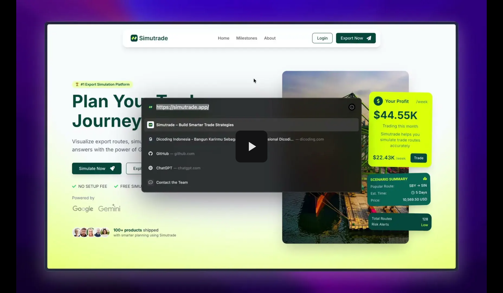
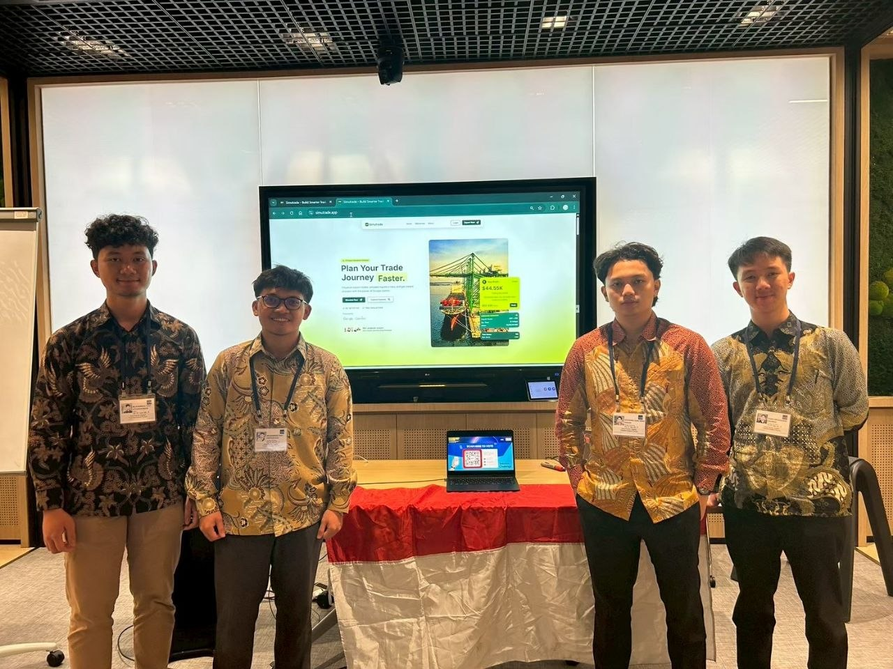

<div align="center">
  <table border="1">
    <tr>
      <td align="center" style="padding: 20px;">
        <h3>📢 Domain & Email Migration Complete</h3>
        <p>As of <b>May 6th, 2026</b>, Simutrade has migrated off <code>simutrade.app</code> (not renewed) and is now served on the <code>faizath.com</code> domain family:</p>
        <p>🌐 <b>Website:</b> <a href="https://simutrade.faizath.com">simutrade.faizath.com</a> (formerly <i>simutrade.app</i>)<br>
        ⚙️ <b>API:</b> <a href="https://simutrade-api.faizath.com">simutrade-api.faizath.com</a> (formerly <i>api.simutrade.app</i>)<br>
        📧 <b>Email:</b> <a href="mailto:contact@simutrade.faizath.com">contact@simutrade.faizath.com</a> (formerly <i>contact@simutrade.app</i>)<br>
        🛰️ <b>CDN:</b> <a>simutrade-cdn.faizath.com</a> (formerly <i>cdn.simutrade.app</i>)<br>
        📈 <b>Status Pages:</b> <a href="https://status.faizath.com/status/simutrade">https://status.faizath.com/status/simutrade</a> (formerly <i>status.simutrade.app</i>)
        </p>
      </td>
    </tr>
  </table>
</div>

<div align="center">
  
  <h1 align="center">🚀 Simutrade</h1>
  <h3 align="center">AI-Powered Trade Supply Chain Simulation Platform</h3>
  
  <p align="center">
    
  </p>
  
  <p align="center">
    <a href="https://simutrade.faizath.com">🌐 Live Demo</a> •
    <a href="https://simutrade-api.faizath.com">🔗 API</a> •
    <a href="https://status.faizath.com/status/simutrade">📊 Status</a> •
    <a href="#-competition-achievement">🏆 Achievement</a> •
    <a href="#-repository-architecture">📁 Repositories</a> •
    <a href="#-tech-stacks">🛠️ Tech Stack</a>
  </p>
</div>

## 🎬 Demo Video

<div align="center">
  <a href="https://drive.google.com/file/d/14eXdPWHsSgBYRP-9KojyD9x7LFupAVNk/preview">
    
  </a>
  <p><em>▶️ Click to watch the Simutrade demo</em></p>
</div>

## 🌟 What is Simutrade?

**Simutrade** is a cutting-edge AI-powered platform that revolutionizes trade supply chain simulation and analysis. Built with modern web technologies, it provides businesses, traders, and analysts with powerful tools to simulate, analyze, and optimize global trade scenarios in real-time.

## 🎯 The Problem It Solves

Global trade and supply-chain planning is **fragmented, slow, and difficult to model**. Before committing real capital, traders and small-to-medium enterprises (SMEs) struggle to answer basic questions: *Which route is cheapest? What tariffs and duties apply? How long will it take? What disrupts the journey?*

- **Scattered information** — routes, costs, tariffs, and logistics data live across disconnected systems and spreadsheets.
- **High barrier to entry** — professional trade-modeling tools are expensive and complex, leaving SMEs, students, and analysts underserved.
- **No safe space to experiment** — there is no accessible "sandbox" to simulate a trade journey and compare scenarios before real money is on the line.
- **Reactive, not predictive** — decisions are made without data-driven forecasting of risk, cost, and time.

## 💡 How Simutrade Solves It

Simutrade turns trade planning into an **interactive, AI-assisted simulation** — letting anyone model, compare, and optimize a trade journey in minutes instead of weeks:

- **🤖 AI-Powered Simulation Engine** — model trade routes, costs, tariffs, and timelines and get instant, data-driven feedback on each scenario.
- **🌍 Interactive Global Maps** — visualize trade flows and supply-chain networks in real time to understand the full journey at a glance.
- **📊 Real-Time Analytics** — dashboards surface KPIs, sentiment, and trend forecasting so decisions are predictive rather than reactive.
- **💬 AI Assistant (RAG)** — a Retrieval-Augmented Generation assistant answers trade questions and recommends optimal strategies in plain language.
- **🎯 Mission-Based Strategy** — guided, goal-oriented workflows help users identify opportunities and de-risk their plans before committing.

Together these make professional-grade trade simulation **accessible, fast, and affordable** for SMEs, analysts, students, and policy makers alike.

### ✨ Key Features

- 🤖 **AI-Powered Analysis**: Advanced machine learning algorithms for trade pattern recognition and prediction
- 🌍 **Interactive Global Maps**: Real-time visualization of trade flows and supply chain networks
- 📊 **Advanced Analytics**: Comprehensive dashboards with KPIs, sentiment analysis, and trend forecasting
- 🔄 **Real-time Simulation**: Live trade scenario modeling with instant feedback
- 🎯 **Strategic Planning**: Mission-based trading strategies and opportunity identification
- 💬 **AI Assistant**: Intelligent chat interface for trade insights and recommendations
- 📈 **Data Visualization**: Rich charts, graphs, and interactive components for data analysis

### 🎯 Target Users

- **Trade Analysts**: Professionals analyzing global trade patterns and market trends
- **Supply Chain Managers**: Teams optimizing logistics and distribution networks
- **Business Strategists**: Decision-makers planning international expansion
- **Students & Educators**: Learning global trade dynamics through interactive simulation
- **Policy Makers**: Government officials understanding trade impact and regulations

## 🏆 Competition Achievement

### 🌏 About the Google APAC Solution Challenge 2025

The **[Google APAC Solution Challenge 2025](https://hack2skill.com/event/apacsolutionchallenge)** is Google's annual region-wide hackathon for students across the Asia-Pacific. Teams are challenged to build real-world solutions to problems aligned with the **United Nations Sustainable Development Goals (SDGs)** using Google technologies — and compete for a place among the region's top teams.

**Simutrade was built specifically for this hackathon, under the *Trade* challenge topic** — addressing how technology can make global trade more accessible, efficient, and data-driven for businesses and emerging economies.

### 🥇 Top 10 Finalist

**Simutrade** was selected as a **Top 10 Finalist** in the prestigious **Google APAC Solution Challenge 2025**! Our team **ITBebas** had the incredible opportunity to travel to the Philippines and present our solution at the Asian Development Bank Headquarters.

<div align="center">
  
  <p><em>Simutrade recognized as Top 10 Finalist in Google APAC Solutions Challenge 2025</em></p>
</div>

### 🌟 Our Journey

- **🏢 Google Philippines Office Visit**: Our team had the privilege of visiting Google's Philippines office, experiencing the innovative culture and meeting with Google engineers
- **🏛️ Asian Development Bank Presentation**: We presented Simutrade at the Asian Development Bank Headquarters, showcasing our AI-powered trade simulation platform to industry experts
- **🎯 Top 10 Achievement**: While we didn't reach the Top 3, being selected as a Top 10 finalist was an incredible honor and validation of our solution's potential
- **🤝 Networking & Learning**: The experience provided invaluable networking opportunities and insights into the future of trade technology

### 📚 Competition Resources

- **Official Competition**: [Google APAC Solution Challenge 2025](https://hack2skill.com/event/apacsolutionchallenge)
- **Archived Competition Page**: [Archive Version](https://archive.faizath.com/archive/1751469385.462976/index.html)

### 📸 Journey Gallery

<div align="center">
  <table>
    <tr>
      <td align="center" width="50%">
        
        <p><em>🏢 Our team visiting the Google Philippines Office</em></p>
      </td>
      <td align="center" width="50%">
        
        <p><em>👋 Team introduction at the Google Philippines Office</em></p>
      </td>
    </tr>
    <tr>
      <td align="center" width="50%">
        
        <p><em>🛰️ The Simutrade booth at the Asian Development Bank HQ</em></p>
      </td>
      <td align="center" width="50%">
        
        <p><em>🏆 The Top 3 awarding ceremony at the Asian Development Bank HQ</em></p>
      </td>
    </tr>
  </table>
</div>

This achievement demonstrates Simutrade's potential to revolutionize global trade simulation and its recognition by leading technology and development organizations.

## 🏗️ Repository Architecture

Simutrade is built as a modular, microservices-based architecture with three main repositories:

### 📱 Frontend Repository (This Repository)
**Repository**: [simutrade-app/simutrade-fe](https://github.com/simutrade-app/simutrade-fe)  
**Live URL**: [simutrade.faizath.com](https://simutrade.faizath.com)  
**Description**: Modern React-based user interface with TypeScript, featuring interactive dashboards, real-time maps, and AI-powered analytics.

### 🔧 API Backend Repository
**Repository**: [simutrade-app/simutrade-api](https://github.com/simutrade-app/simutrade-api)  
**Live URL**: [simutrade-api.faizath.com](https://simutrade-api.faizath.com)  
**Description**: RESTful API server handling business logic, data processing, user authentication, and real-time WebSocket communications.

### 🧠 AI & RAG Backend Repository
**Repository**: [simutrade-app/simutrade-ai](https://github.com/simutrade-app/simutrade-ai)  
**Description**: Specialized AI service providing machine learning models, natural language processing, trade pattern recognition, and intelligent recommendations using Retrieval-Augmented Generation (RAG) techniques.


## 📸 Screenshots

<div align="center">
  <table>
    <tr>
      <td width="50%"></td>
      <td width="50%"></td>
    </tr>
    <tr>
      <td width="50%"></td>
      <td width="50%"></td>
    </tr>
    <tr>
      <td width="50%"></td>
      <td width="50%"></td>
    </tr>
    <tr>
      <td width="50%"></td>
      <td width="50%"></td>
    </tr>
    <tr>
      <td width="50%"></td>
      <td width="50%"></td>
    </tr>
  </table>
</div>

## 🛠️ Tech Stacks

### 🎨 Frontend Framework & Core
| Technology | Purpose | Description |
|------------|---------|-------------|
| **React 18** | UI Framework | Modern component-based architecture with hooks and concurrent features |
| **TypeScript** | Type Safety | Static type checking for enhanced code quality and developer experience |
| **Vite** | Build Tool | Lightning-fast development server and optimized production builds |

### 🎨 Styling & UI Components
| Technology | Purpose | Description |
|------------|---------|-------------|
| **Tailwind CSS** | Styling | Utility-first CSS framework for rapid custom design development |
| **Radix UI** | Components | Accessible, unstyled UI primitives for building design systems |
| **Ant Design** | UI Library | Comprehensive React components with polished design resources |
| **Lucide React** | Icons | Beautiful, consistent icon library for React applications |
| **Font Awesome** | Icons | Popular scalable vector icons with React components |

### 📊 Data Visualization & Maps
| Technology | Purpose | Description |
|------------|---------|-------------|
| **Recharts** | Charts | Composable charting library built on React and D3 |
| **Leaflet + React Leaflet** | Maps | Interactive maps with React bindings for geospatial visualization |
| **React Resizable Panels** | Layout | Flexible draggable and resizable panel layouts |

### 🔄 State Management & Data Fetching
| Technology | Purpose | Description |
|------------|---------|-------------|
| **React Query** | Server State | Powerful data fetching, caching, and synchronization |
| **React Hook Form** | Forms | Performant form library with validation and state management |
| **Zod** | Validation | TypeScript-first schema validation for data parsing |

### 🌐 Networking & Real-time
| Technology | Purpose | Description |
|------------|---------|-------------|
| **Axios** | HTTP Client | Promise-based HTTP client for API requests |
| **Socket.IO Client** | Real-time | Bidirectional event-based communication for live updates |

### 🎭 Animation & Interactions
| Technology | Purpose | Description |
|------------|---------|-------------|
| **GSAP** | Animation | High-performance animation library for complex interactions |
| **Embla Carousel** | Carousel | Lightweight, touch-friendly carousel component |
| **React Day Picker** | Date Picker | Accessible date selection component |

### 🛠️ Development Tools
| Technology | Purpose | Description |
|------------|---------|-------------|
| **ESLint** | Code Quality | Static analysis tool for finding and fixing code issues |
| **Prettier** | Code Formatting | Opinionated code formatter for consistent style |
| **PostCSS** | CSS Processing | CSS transformation with JavaScript plugins |
| **Jest** | Testing | JavaScript testing framework with React Testing Library |

### 📦 Utility Libraries
| Technology | Purpose | Description |
|------------|---------|-------------|
| **date-fns** | Date Manipulation | Lightweight library for modern date operations |
| **React Markdown** | Content | Markdown rendering component for rich text content |
| **Sonner** | Notifications | Minimal toast notification library with animations |
| **Vaul** | Modals | Accessible modal component with better ergonomics |
| **clsx** | Styling | Utility for conditionally joining classNames |
| **React Router DOM** | Routing | Standard routing library for React navigation |

## ⚙️ Installation & Setup

### 🚀 Quick Start

1. **Clone the Frontend Repository**
   ```bash
   git clone https://github.com/simutrade-app/simutrade-fe.git
   cd simutrade-fe
   ```

2. **Install Dependencies**
   ```bash
   npm install
   ```

3. **Start Development Server**
   ```bash
   npm run dev
   ```

4. **Open in Browser**
   Navigate to `http://localhost:5173` to view the application.

### 📋 Available Scripts

| Command | Description |
|---------|-------------|
| `npm run dev` | Start development server with hot reload |
| `npm run build` | Build production-ready application |
| `npm run preview` | Preview production build locally |
| `npm run lint` | Run ESLint for code quality checks |
| `npm run lint:fix` | Auto-fix ESLint issues |
| `npm run format` | Format code with Prettier |
| `npm run test` | Run Jest test suite |
| `npm run test:watch` | Run tests in watch mode |
| `npm run test:coverage` | Generate test coverage report |

### 🔧 Development Requirements

- **Node.js**: Version 18 or higher
- **npm**: Version 8 or higher
- **Modern Browser**: Chrome, Firefox, Safari, or Edge with ES6+ support

### 🌐 Production Deployment

The application is automatically deployed to [simutrade.faizath.com](https://simutrade.faizath.com) using modern CI/CD pipelines with:
- **Frontend**: Cloudflare Pages deployment
- **API Backend**: [simutrade-api.faizath.com](https://simutrade-api.faizath.com)
- **AI Services**: Integrated with the main platform

### 📊 System Status

Monitor the real-time status of all Simutrade services:
- **Status Page**: [status.faizath.com/status/simutrade](https://status.faizath.com/status/simutrade)
- **Services Monitored**:
  - 🌐 Simutrade Web (simutrade.faizath.com)
  - 🔗 Simutrade API (simutrade-api.faizath.com)
  - 🤖 Simutrade AI
  - 🗄️ Simutrade MongoDB
  - 📡 Simutrade CDN (simutrade-cdn.faizath.com)

## 🤝 Contributing

We welcome contributions from the community! Here's how you can help:

### 🐛 Bug Reports
- Use GitHub Issues to report bugs
- Include steps to reproduce the issue
- Provide system information and error logs

### 💡 Feature Requests
- Submit feature requests via GitHub Issues
- Describe the use case and expected behavior
- Consider the impact on existing functionality

### 🔧 Development Setup
1. Fork the repository
2. Create a feature branch: `git checkout -b feature/amazing-feature`
3. Make your changes and add tests
4. Run the test suite: `npm test`
5. Commit your changes: `git commit -m 'Add amazing feature'`
6. Push to the branch: `git push origin feature/amazing-feature`
7. Open a Pull Request

### 📋 Code Standards
- Follow TypeScript best practices
- Use ESLint and Prettier for code formatting
- Write comprehensive tests for new features
- Update documentation as needed

## 🏆 Acknowledgments

- **React Team** for the amazing framework
- **Vite Team** for the lightning-fast build tool
- **Tailwind CSS** for the utility-first CSS framework
- **Radix UI** for accessible component primitives
- **All Contributors** who help make Simutrade better

## 📞 Support & Contact

- **Website**: [simutrade.faizath.com](https://simutrade.faizath.com)
- **API Documentation**: [simutrade-api.faizath.com](https://simutrade-api.faizath.com)
- **Email**: [contact@simutrade.faizath.com](mailto:contact@simutrade.faizath.com)
- **Issues**: [GitHub Issues](https://github.com/simutrade-app/simutrade-fe/issues)
- **Discussions**: [GitHub Discussions](https://github.com/simutrade-app/simutrade-fe/discussions)

## 📝 License

This project is licensed under the **MIT License** - see the [LICENSE](LICENSE) file for details.

---

<div align="center">
  <p>Made with ❤️ by the Simutrade Team</p>
  <p>
    <a href="https://simutrade.faizath.com">🌐 Visit Simutrade</a> •
    <a href="https://github.com/simutrade-app">👥 Our Organization</a> •
    <a href="https://github.com/simutrade-app/simutrade-fe/stargazers">⭐ Star this repo</a>
  </p>
</div>
